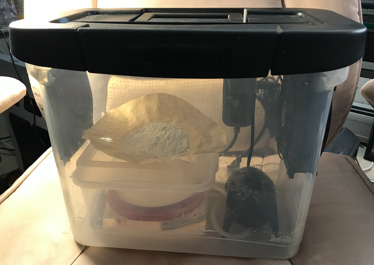

[](https://github.com/ZanzyTHEbar/ESP32GreenhouseTowerDIY/issues) [](https://github.com/ZanzyTHEbar/ESP32GreenhouseTowerDIY/network)

----

# Welcome to ESP32 Greenhouse Tower DIY
{: .no_toc }

## Table of contents
{: .no_toc .text-delta }

* TOC
{:toc}

Welcome to the documentation for the *ESP32* based Greenhouse Tower DIY :seedling:, version 1.
{: .fs-6 .fw-300 }

A DIY vertical tower garden for indoor or outdoor use :cactus:.
{: .fs-6 .fw-300 }

|  |
|:--:|
| *The outer box and fan are optional for experimentation. The humidification chamber and air pump are the minimum required items.* |


[](https://github.com/ZanzyTHEbar/ESP32GreenhouseTowerDIY/issues) [](https://github.com/ZanzyTHEbar/ESP32GreenhouseTowerDIY/network) [](https://github.com/ZanzyTHEbar/ESP32GreenhouseTowerDIY/stargazers) [](https://github.com/ZanzyTHEbar/ESP32GreenhouseTowerDIY/blob/main/LICENSE)

# :seedling: ESP32GreenhouseTowerDIY :seedling:

This repo is dedicated to the **DIY ESP32** based automated *Aeroponic* or *Hydroponic* Modular Tower Garden :cactus: .

# WHAT IS THIS PROJECT

In the height of COVID my wife and i wanted to grow our own food indoors. This open source project is a culmination of my own work and many inspirations from the internet to develop an easy, approachable and beginner friendly project for hobbyists.

This project is designed to be modular and affordable. Featuring a vertical tower system with interlocking parts and an adapter to a common 20L/5gallon bucket.

The design also features an optional 3D printable Aeroponic Nozzle for converting the system from hydroponic to aeroponic.  

I decided to go with an ESP32 using Micropython firmware. While Arduino is perfectly fine, i wanted this project to be approachable to all skil levels, python seemed like the most comon first "language".


%20Bucket%20Lid%20Adapter/images/IMG_5375.JPG)

# HOW TO ORDER PCBS

PCBS can be ordered from JLCPCB or PCBWay, or made yourself. The PCB files are still in prototype phase and I welcome any development ideas.

The old PCB is designed to be used with a GPIO extension board - however this was for my personal use-case. This can be changed, or i can make this adaptation upon request.

## Important Notes

> **Note**: I have not tested this on a raspberry pi, but i have tested it on a WROOM and WROVER.

> **Important**: If you receive the error:

      WebAuthentication.cpp:73: undefined reference to mbedtls_md5_starts

> Please remove the code *within* the `ifdef ESP32` block on line `72`. and paste the following:

```ino
   mbedtls_md5_init(&_ctx); mbedtls_md5_update_ret (&_ctx,data,len);
   mbedtls_md5_finish_ret(&_ctx,data);
   mbedtls_internal_md5_process( &_ctx ,data); // mbedtls_md5_starts(&_ctx); // mbedtls_md5_update(&_ctx, data, len); // mbedtls_md5_finish(&_ctx, _buf);
```

> the comments are the old-lines.

# Licenses

[](https://github.com/ZanzyTHEbar/ESP32GreenhouseTowerDIY/blob/master/LICENSE){:target="_blank"}

***All hardware materials and designs provided here are licensed under the [CERN-OHL-P](https://opensource.org/CERN-OHL-P){:target="_blank"} hardware license.
All software is under the MIT License.
All documentation, including the Wiki, is under the Creative Commons CC-BY-SA-4.0 license***.

<div align="center">
    
</div>
